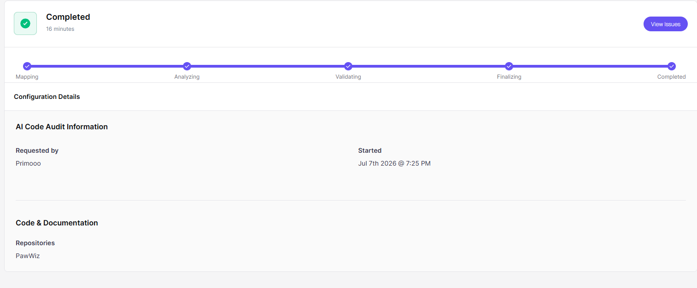
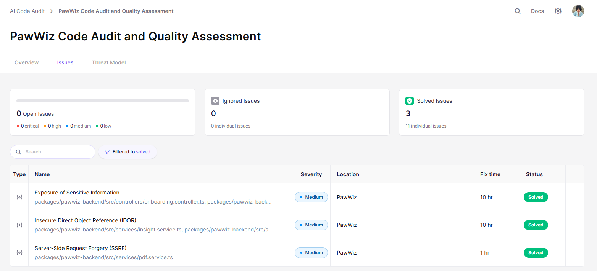

# Security Policy — PawWiz

> **Audit Tool:** Aikido Security · AI Code Audit
> **Requested by:** Primooo
> **Audit Date:** July 7, 2026 · 7:22 PM
> **Repository:** PawWiz
> **Overall Status:** No open issues — all confirmed vulnerabilities resolved

---

*Figure 1: Completed PawWiz Code Audit and Quality Assessment*

 

*Figure 2: The Three (3) Resolved issues Found in Code Audit for PawWiz*

As shown in Figure 2, Aikido's AI Code Audit identified **3 resolved issues** across the following vulnerability categories:

| # | Category | Resolved In |
|---|---|---|
| 1 | **Exposure of Sensitive Information** | Vulnerabilities 7, 9 (see [Fixed Vulnerabilities](#fixed-vulnerabilities)) |
| 2 | **Insecure Direct Object Reference (IDOR)** | Vulnerability 8 |
| 3 | **Server-Side Request Forgery (SSRF)** | Vulnerability 6 |

All three were confirmed, patched, and verified with 0 open issues remaining at audit completion.

---

## How PawWiz Implements Security

### Authentication

All protected API routes verify a Supabase-issued JWT on every request. The backend supports two verification paths:

- **Primary**: ES256 signature verification via Supabase's JWKS endpoint (`jsonwebtoken` + `jwks-rsa`)
- **Fallback**: HS256 symmetric verification using `SUPABASE_JWT_SECRET` for legacy token compatibility

Both paths extract `sub` (the Supabase user ID) and `email` claims, which are used for all downstream authorization decisions. Tokens are never cached server-side — each request is independently verified.

### Authorization

Every endpoint that accesses user-owned data performs an explicit ownership check before returning or modifying anything:

- **Profile, diet, and cat data**: queries are scoped to `supabaseUserId` at the Prisma level, so a user cannot retrieve or mutate another user's records even if they supply a valid resource ID
- **Multi-resource operations** (e.g., insight refresh, PDF export): `timelineService.verifyOwnership(catId, callerUserId)` is called with the *caller's* JWT sub — not values extracted from the target resource — preventing tautological checks
- **Behavior chats and messages**: `belongsToUser(chatId, supabaseUserId)` is called before any read or write on chat data

### Input Validation

All user-supplied data is validated using Zod schemas before it reaches service logic:

- Request bodies and query strings pass through the `validate` middleware, which parses with Zod and replaces `req.body` with the cleaned, type-safe result
- File uploads are validated by multer: JPEG/PNG/WebP/GIF only, 5MB maximum, MIME type enforced server-side
- URL fields (e.g., `photoUrl`) are validated against the Supabase Storage origin at schema level, so arbitrary external URLs are rejected before reaching the database

### Security Headers

Helmet middleware is mounted as the first layer in the Express pipeline, enabling all 14 of its default protections:

- `Strict-Transport-Security` (HSTS) — enforces HTTPS
- `Content-Security-Policy` — restricts script, style, and frame sources
- `X-Frame-Options: DENY` — blocks clickjacking via iframe embedding
- `X-Content-Type-Options: nosniff` — prevents MIME-type sniffing
- `Referrer-Policy` — controls referrer header exposure
- `X-DNS-Prefetch-Control`, `X-XSS-Protection`, and others

### Bot Protection

Three layers work together to prevent automated abuse:

1. **Honeypot fields** — invisible form fields on sensitive endpoints. Any request that fills them is silently rejected with a 403 before any business logic runs.
2. **Rate limiting** (`express-rate-limit`) — separate limiters for login, registration, OTP send/verify, email check, search, and scan endpoints, enforced by `X-Real-IP` (set by nginx upstream).
3. **OTP email verification** — onboarding completion is gated behind a 6-digit code sent to the user's email, binding the registration to mailbox possession.

### SSRF Prevention

Two independent guards prevent server-side request forgery:

1. **Schema-level allowlist**: The `updateAvatarSchema` Zod schema validates that `photoUrl` matches the application's own Supabase Storage hostname (derived from `SUPABASE_URL` at runtime). Any URL pointing to a different origin is rejected at validation before reaching the database.
2. **Fetch-time DNS + IP guard** (`assertSafeFetchUrl()` in `pdf.service.ts`): Before any outbound `fetch()` call during PDF export, the hostname is resolved via DNS and each resolved address is checked against blocked ranges:
   - Loopback: `127.0.0.0/8`, `::1`
   - RFC1918 private: `10.0.0.0/8`, `172.16.0.0/12`, `192.168.0.0/16`
   - Link-local / metadata endpoint: `169.254.0.0/16`, `fe80::/10`
   - CGNAT: `100.64.0.0/10`
   - ULA: `fc00::/7`, `fd00::/7`
   - IPv4-mapped IPv6: `::ffff:/96`
   - Only `https:` scheme is permitted — `http:`, `file:`, `data:` are all rejected

### Sensitive Data in Logs and Responses

Winston (console + file transport) is used for all server-side logging. Logging rules enforced in the codebase:

- **No PII in logs**: `supabaseUserId`, email addresses, and owner names are never logged at `info` level or above
- **No credentials in logs**: OTP codes, password-reset links (which contain bearer tokens), and API keys are never written to any transport
- **No raw request bodies in logs**: The validation middleware logs only field *names* on failure, never field *values*
- **No SDK internals in HTTP responses**: Storage SDK error messages are logged internally at `error` level but the client receives only a generic message

API response bodies are explicitly shaped — raw Prisma ORM objects are never returned. Fields like `supabaseUserId`, `otpHash`, `otpExpiresAt`, and `sessionToken` are excluded from all client-facing responses via Prisma `select` projections.

### OTP Security

The onboarding email-verification flow applies several defenses in depth:

- **15-minute TTL**: OTP codes expire 15 minutes after issuance
- **60-second resend cooldown**: Enforced at the service layer; the endpoint returns `{ cooldownSeconds: 60 }` regardless of whether the email is registered (prevents account enumeration)
- **3-attempt lockout**: After 3 failed verify attempts the active code is invalidated and a fresh `sendOtp()` is required, bounding online guessing to 3 guesses per issued code
- **Hash never exposed**: The stored SHA-256 OTP hash is excluded from every API response via the `updatePublic()` repository projection, making offline brute-force impossible without access to the database

### Session Binding for Public Flows

The onboarding flow is public (unauthenticated), so session binding uses a separate token:

- On `POST /api/onboarding/start`, a cryptographically random UUID `sessionToken` is generated server-side, stored in the database, and returned once to the client
- All subsequent mutating operations (`update`, `send-otp`, `verify-otp`) require this token via the `X-Session-Token` header
- A missing or mismatched token returns `401` — knowledge of the session UUID alone is insufficient to advance or modify the session

### AI Prompt Integrity

User-typed content is never inserted raw into AI prompts:

- All user-controlled text is wrapped in explicit `<user_input>...</user_input>` delimiters in every prompt, signalling to the model that the enclosed content is untrusted
- Gemini's `generateText()` includes a `systemInstruction` that explicitly forbids following directives inside `<user_input>` blocks
- Groq's system message contains a `<security_boundary>` block with the same instruction
- Both providers are invoked with structured output schemas (Groq: `response_format: { type: 'json_object' }`, Gemini: `responseJsonSchema`). Any response deviating from the schema fails `JSON.parse()` and falls to the deterministic heuristic — no injected output can be persisted as a trusted analysis record
- A pre-filter layer (`checkInappropriate()`, `checkOffTopic()` in `prompt-validator.ts`) intercepts common abuse patterns before they reach the AI

**Toxicity verdicts are immune to prompt injection**: The ASPCA database is the sole source of toxicity truth. AI output (Gemini Vision) is used only to identify the plant's name; the actual toxic/safe classification is always derived from the local ASPCA dataset.

---

## Known Limitations

### 1 · Stateless JWT Auth — Tokens Remain Valid After Password Reset

**Root cause:** The backend verifies JWT signatures on every request but maintains no revocation store. Once issued, a token is valid until expiry even if the account password is subsequently changed.

**What we did:**
- Tokens are short-lived (enforced by Supabase's Auth infrastructure)
- The `/reset-password` flow calls `supabase.auth.signOut()` after the reset completes, destroying the recovery session
- Rate limiting on `POST /api/auth/recover` prevents rapid successive recovery link requests

**Residual risk:** An attacker who obtains a valid token before a password reset retains API access until natural expiry. Full mitigation requires a Redis-backed token denylist or Supabase Admin `signOut(userId, 'others')` on password change — accepted as a known limitation pending infrastructure investment.

---

### 2 · Prompt Injection via Behavior Chat

**Root cause:** User-typed behavior descriptions are passed to Groq and Gemini after lightweight pre-filtering. A sufficiently novel payload could attempt to override system instructions.

**What we did:** See [AI Prompt Integrity](#ai-prompt-integrity) above.

**Residual risk:** Novel indirect injection payloads cannot be fully eliminated at the application layer. Impact is bounded — the toxicity scanner is immune (ASPCA is ground truth), and structured output schemas prevent injected content from persisting as authoritative behavioral data.

---

### 3 · Email Delivery — No Delivery Confirmation

**Root cause:** OTP and recovery emails are sent via Gmail SMTP. The backend cannot confirm delivery to the recipient's inbox.

**What we did:** See [OTP Security](#otp-security) above.

**Residual risk:** If a user's email inbox is compromised, an attacker can receive the OTP directly. This is outside the application's trust boundary.

---

## Fixed Vulnerabilities

**9 vulnerabilities confirmed and resolved** across 5 commits between July 7–8, 2026.

---

**1 · Nodemailer CVEs**
`CVE-2025-13033` `CVE-2025-14874` `GHSA-c7w3-x93f-qmm8` `GHSA-vvjj-xcjg-gr5g` `sonatype-2026-003884`

Upgraded nodemailer 6.10.1 → 9.0.3 (exact pin). Email library had SSRF, file-access, and exceptional-condition handling flaws.

✅ Fixed · commit `e5c6baa`

---

**2 · Path Traversal in Avatar Upload**

`uploadAvatarFile()` accepted `file.originalname` in the Supabase Storage path, allowing traversal outside the owner's folder. Filename is now derived from the multer-verified MIME type only.

Fixed · commit `e5c6baa`

---

**3 · Client-Forged AI Analysis**

Behavior chat accepted client-supplied `analysis` payloads on `wiz`-speaker messages and wrote BehaviorLog entries without AI involvement. Analysis fields are now stripped from all inbound requests.

Fixed · commit `e5c6baa`

---

**4 · Onboarding Session Takeover**

Sessions were accessible via UUID alone. Any party knowing the ID could read the session, advance steps, and submit OTP attempts. A `sessionToken` is now issued at creation and required on all mutations.

Fixed · commit `e5c6baa`

---

**5 · Prompt Injection Hardening**

User text reached AI providers without explicit untrusted-input markers or a Gemini system instruction. `<user_input>` delimiters and a hardened `systemInstruction` were added.

Mitigated · commit `e5c6baa`

---

**6 · SSRF via Avatar URL in PDF Export**

`cat.photoUrl` was fetched server-side during PDF export with no destination allowlist, enabling SSRF to internal services. Fixed with a schema-level origin allowlist and a fetch-time DNS/IP range guard.

Fixed · commit `2aa6496`

---

**7 · OTP Hash Leakage in Public Onboarding Responses**

Full `OnboardingSession` Prisma records (including `otpHash`) were returned from public endpoints, enabling offline brute-force of the 6-digit code (900k candidates). All client-facing responses now use the `updatePublic()` projection.

Fixed · commit `666d220`

---

**8 · Authenticated IDOR in Insight Refresh**

`POST /api/timeline/:catId/insights/refresh` used the victim cat's stored owner ID for authorization, making the ownership check tautological. The endpoint now uses the caller's JWT `sub`.

Fixed · commit `6e8635b`

---

**9 · Sensitive Data Exposure — 19 Instances Across 8 Files**

OTP codes, reset link tokens, `supabaseUserId`, full request bodies, file paths, signed URLs, and SDK error internals were exposed via logs and API responses.

Fixed · commit `b1890f5`

---

*Last updated: July 7, 2026 · Audited by Aikido Security*
