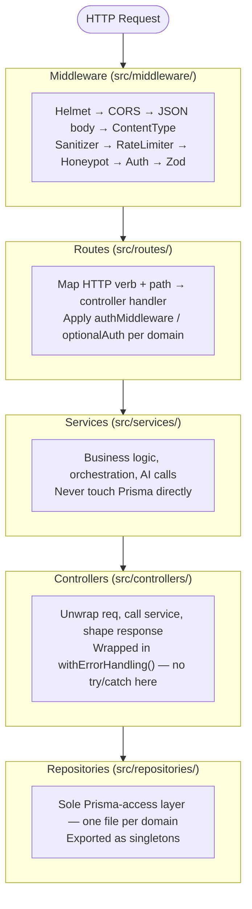
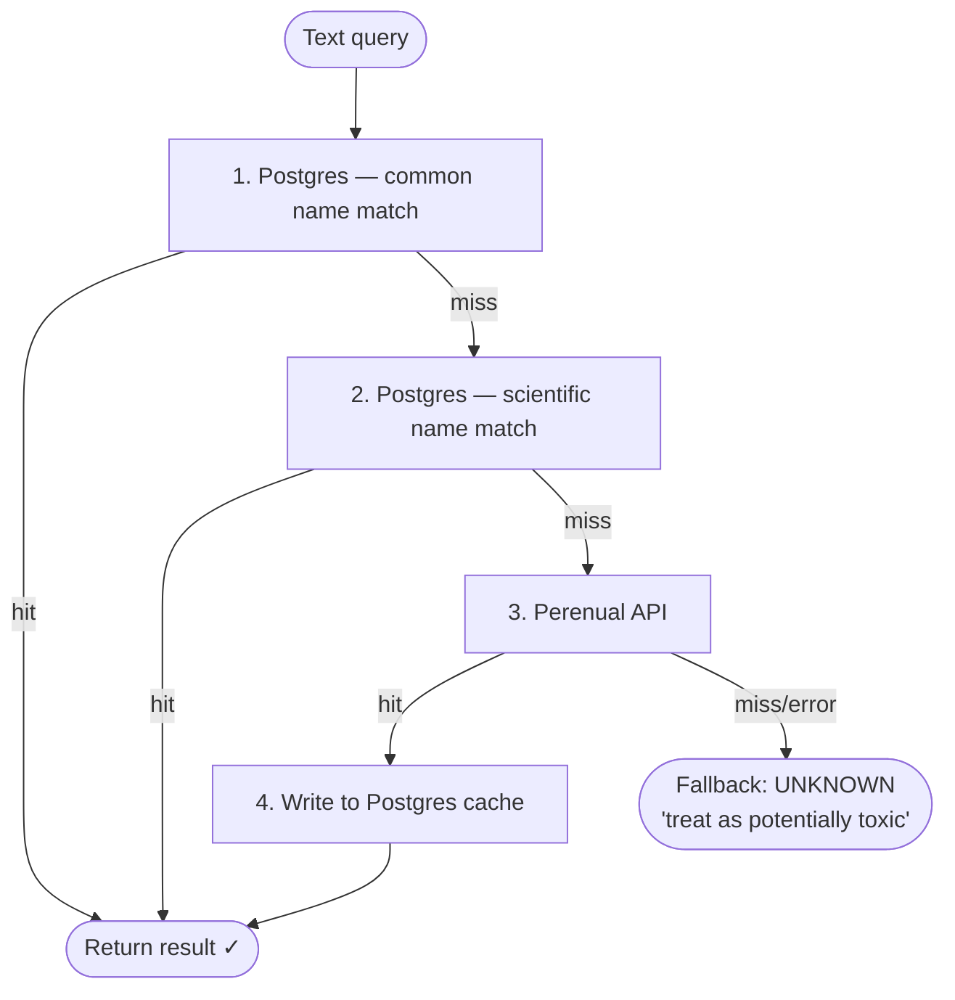
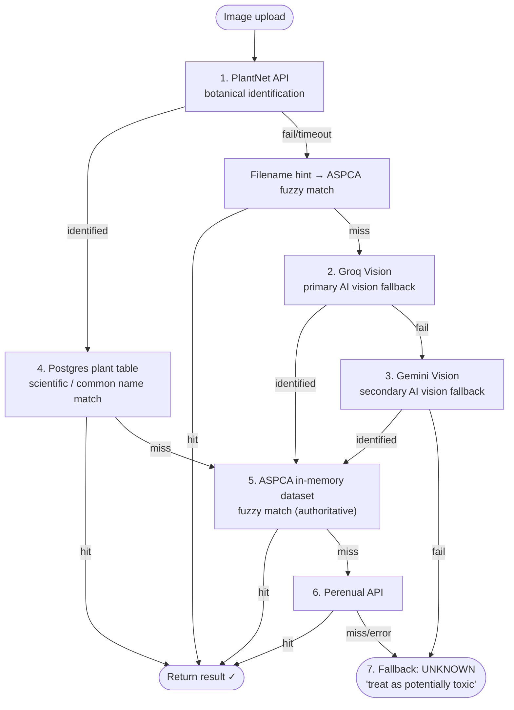
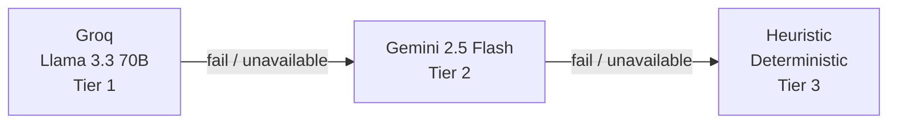

# Backend Architecture — pawwiz-backend

Express 5 + TypeScript 6 + Prisma 7 + PostgreSQL. Node.js ES modules throughout.

---

## MRSC Layering

Every API request flows through a strict four-layer stack. No layer skips ahead.



**Why this order?** Controllers are downstream of services, not upstream. A controller's only job is HTTP translation — it calls the service and shapes the response. The service owns all logic. This means services are fully testable without Express, and controllers stay thin by design.

**Why singletons?** Repositories hold the Prisma client reference and any in-memory state (e.g. the ASPCA dataset). Exporting a single instance per file makes the dependency graph explicit — no hidden instantiation in tests or during hot reload.

---

## Middleware Pipeline (in mount order)

| Middleware | Purpose |
|---|---|
| `helmetMiddleware` | 14 default security headers (HSTS, CSP, X-Frame-Options, nosniff, …) |
| `corsMiddleware` | Origin allowlist from `FRONTEND_ORIGIN` env var |
| `express.json` | JSON body parsing, 10 MB limit |
| `contentTypeMiddleware` | Enforces `Content-Type: application/json` on mutations (POST/PUT/PATCH) |
| `sanitizerMiddleware` | HTML-strips all string fields in `req.body` |
| `rateLimiter` | Per-endpoint limiters (login, register, OTP, scan, search, recovery) |
| `honeypotMiddleware` | Silent 403 on any request with a filled honeypot field |
| `authMiddleware` | Supabase JWT verification (see Auth section) |
| `validate(schema)` | Zod schema validation — replaces `req.body` with the parsed, typed result |

---

## Authentication

`src/middleware/auth.ts` verifies Supabase-issued JWTs on every protected route.

**Two-path verification:**

1. **ES256 (primary)** — Token `alg` header is inspected. If `ES256`, the signing key is fetched from Supabase's JWKS endpoint (`/auth/v1/.well-known/jwks.json`) using `jwks-rsa`. The JWKS client is cached and rate-limited (10 req/min).

2. **HS256 (fallback)** — Any other algorithm falls back to symmetric verification using `SUPABASE_JWT_SECRET` decoded from Base64.

Both paths validate `iss` (Supabase project URL + `/auth/v1`) and `aud` (`authenticated`) to prevent token replay from other projects.

On success, `req.user = { sub, email, role }` is set. `sub` (the Supabase user UUID) is used for all downstream ownership checks.

---

## Authorization

Ownership is enforced at the **repository/service level**, not in middleware.

- **Profile, cat, diet data** — queries are scoped by `supabaseUserId` at the Prisma `where` clause. Supplying someone else's resource ID simply returns null.
- **Behavior chats** — `belongsToUser(chatId, supabaseUserId)` is called before any read or write.
- **Insight refresh / PDF export** — `timelineService.verifyOwnership(catId, callerUserId)` uses the *caller's* JWT `sub`, never values extracted from the target resource, preventing tautological checks (Fixed Vulnerability 8 in SECURITY.md).

---

## Plant Toxicity Pipeline

The toxicity scanner is the most complex service. It has two entry points and an explicit resolution order that guarantees AI results are **never trusted for the final verdict**.

### Text pipeline (`resolveTextPipeline`)



### Image pipeline (`resolveImagePipeline`)



**The ASPCA ground-truth guarantee:** AI models (PlantNet, Groq Vision, Gemini Vision) identify the plant's *name only*. The actual `TOXIC` / `SAFE` / `CAUTION` verdict always comes from the local ASPCA dataset or the Perenual-seeded Postgres table — never from an AI response field. This makes toxicity verdicts immune to AI hallucination.

**Stale-while-revalidate:** `perenual_cache` records older than 30 days trigger a background refresh via `setImmediate`. A 1-second deduplication guard prevents concurrent refreshes for the same plant; a 60-minute backoff gate prevents retry storms on API failure.

---

## AI Failover Chain

Used by behavior decoding and conversational chat:



Both providers are checked for availability (`client.isAvailable`) before attempting a call. Both use **structured output schemas** — Groq via `response_format: { type: 'json_object' }` with a JSON Schema, Gemini via `responseJsonSchema`. Any response that fails `JSON.parse()` triggers the next tier.

**Prompt injection hardening:** All user-supplied text is wrapped in `<user_input>...</user_input>` delimiters in every prompt. Gemini receives a `systemInstruction` explicitly forbidding instruction-following from within those delimiters. Groq's system message contains an equivalent `<security_boundary>` block.

**Conversational routing:** The behavior decoder distinguishes between a new behavior description and a follow-up question (`isConversational()`). Follow-ups skip the structured decode path and use a plain-text prompt against the conversation history.

---

## Prisma & Database

- **Client singleton** — `src/lib/prisma.ts` exports a single `PrismaClient` instance using the `@prisma/adapter-pg` pool adapter over the `pg` driver. Connection pooling is handled by PgBouncer at the infrastructure level; `?pgbouncer=true` is stripped from `DATABASE_URL` at runtime since the pg driver handles its own pool.
- **Migrations use `DIRECT_URL`** — Prisma's migration engine uses prepared statements, which PgBouncer in transaction mode does not support. `prisma.config.ts` reads `DIRECT_URL` (direct port 5432) for all `prisma migrate` commands and `DATABASE_URL` (pooled) for runtime.
- **Generate the Prisma client** after cloning:
  ```bash
  npm run prisma:generate -w packages/pawwiz-backend
  ```

---

## Error Handling

- All controller handlers are wrapped in `withErrorHandling()` from `base.controller.ts`. This catches synchronous and asynchronous errors and maps `AppError` subclasses to the correct HTTP status codes.
- `AppError` hierarchy lives in `src/utils/errors.ts` — `NotFoundError`, `UnauthorizedError`, `ValidationError`, `ConflictError`, etc.
- Unhandled errors fall to Express's default error handler, which returns a 500.

---

## Logging

Winston with two transports:
- Console (all environments)
- File (`error.log`, `error` level only)

**Rules enforced in code:**
- No PII (`supabaseUserId`, email) at `info` or above
- No OTP codes, reset tokens, or API keys at any level
- No raw request bodies — only field *names* on validation failure
- No SDK error internals in HTTP responses — logged at `error`, client gets a generic message

---

## OTP & Session Security

### OTP (onboarding email verification)
- 6-digit code, SHA-256 hashed before storage
- 15-minute TTL, 3-attempt lockout per code, 60-second resend cooldown
- Hash excluded from all public API responses via `updatePublic()` Prisma projection

### Onboarding session binding
- `POST /api/onboarding/start` generates a cryptographically random `sessionToken` UUID
- All mutations (`update`, `send-otp`, `verify-otp`) require this token via `X-Session-Token`
- Missing or mismatched token → 401

---

## Key Design Decisions

| Decision | Reason |
|---|---|
| ES modules (`"type": "module"`) | Consistent with the broader ecosystem direction; avoids CJS/ESM interop issues with newer packages |
| `tsx watch` in dev | No build step needed during development; TypeScript executed directly |
| `tsc` for production build | Outputs clean JS to `dist/` — no runtime TypeScript dependency |
| `trust proxy = 1` | nginx sets `X-Real-IP`; Express rate limiters and IP-based guards use `req.ip` which reflects this |
| Repositories as singletons | Makes the dependency graph explicit; prevents multiple Prisma client instances |
| Services never call Prisma directly | Enforces testability — services can be unit-tested with mocked repositories |
