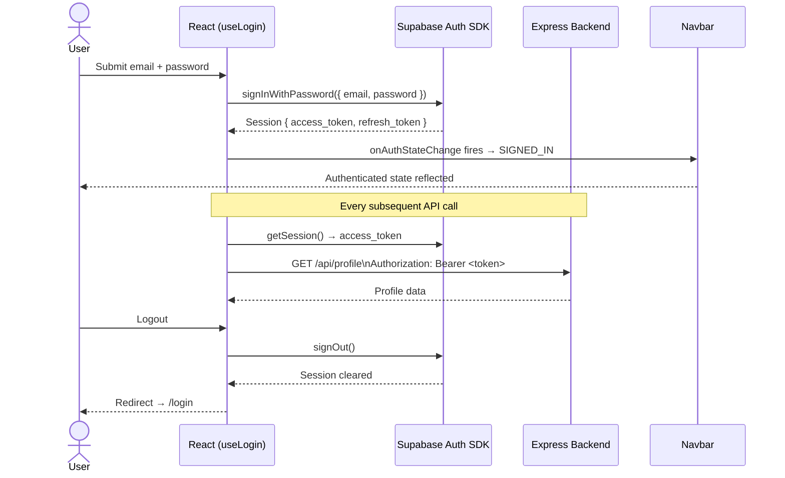
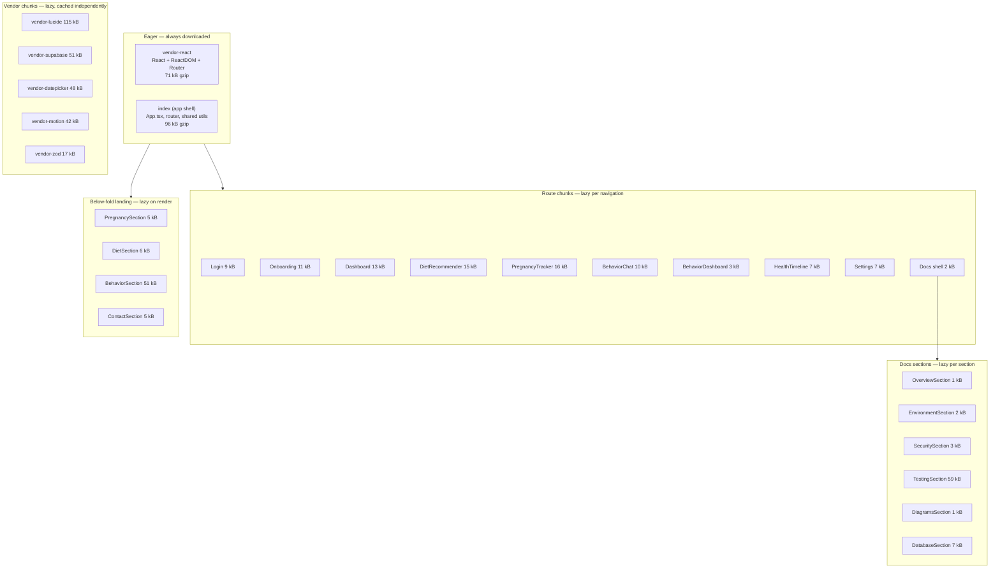

# Frontend Architecture — pawwiz-frontend

React 19 + Vite 8 + Tailwind CSS 4 + TypeScript 6. All components are functional — no class components anywhere.

---

## Core Principle: Pages as Pure UI Shells

Every page component under `src/pages/` is a thin shell that renders layout and delegates everything else:

```tsx
// ✅ Correct — page delegates to a hook
export default function DietRecommender() {
  const { catName, isLoading, ... } = useDietRecommender();
  return <DietDashboardView catName={catName} isLoading={isLoading} ... />;
}

// ❌ Wrong — business logic in a page
export default function DietRecommender() {
  const [data, setData] = useState(null);
  useEffect(() => { fetch('/api/diet/profiles').then(...) }, []);
  ...
}
```

**Why:** Pages are the first thing replaced as the app grows. Keeping them as shells means business logic, API calls, and state are reusable and testable independently of routing.

---

## Directory Structure

```
src/
├── App.tsx                    ← Root layout: Navbar, Footer, PageTransition, outlet
├── main.tsx                   ← React entry, BrowserRouter
├── router.tsx                 ← Route definitions (all routes lazy-loaded)
│
├── pages/                     ← Route shells — no business logic
│   ├── Home.tsx
│   ├── Login.tsx
│   ├── Onboarding.tsx
│   ├── Settings.tsx
│   ├── Docs.tsx
│   └── docs/                  ← Docs sub-sections (each lazy-loaded)
│
├── components/
│   ├── layout/                ← Navbar, Footer, BottomNav, LoadingScreen, PageTransition
│   ├── features/              ← Feature UIs (one subfolder per domain)
│   │   ├── behavior/          ← BehaviorChat, BehaviorDashboard, ChatWindow
│   │   ├── dashboard/         ← Dashboard, charts
│   │   ├── diet/              ← DietRecommender, DietSetupView, DietDashboardView
│   │   ├── heat/              ← CatHeatTracker
│   │   ├── landing/           ← Hero, PregnancySection, DietSection, BehaviorSection, ContactSection
│   │   ├── onboarding/        ← OnboardingScreen1-7, OtpScreen, SearchableDropdown
│   │   ├── pregnancy/         ← PregnancyTracker, SetupView, DashboardView
│   │   └── timeline/          ← HealthTimelinePage
│   └── ui/                    ← Reusable primitives: forms, modals, skeletons, smoothui
│
├── hooks/
│   ├── auth/                  ← useLogin, useForgotPassword, useResetPassword
│   ├── features/              ← useDietRecommender, useBehaviorChat, usePlantScan, ...
│   ├── onboarding/            ← useOnboarding, useOnboardingState, useOnboardingValidation
│   ├── trackers/              ← useGestationCalculator, usePregnancyTracker, useWeightManager
│   └── ui/                    ← useFormValidation, useModalToggle, useBodyScrollLock, ...
│
├── context/
│   └── OnboardingContext.tsx  ← Multi-step onboarding state (React Context, no Redux)
│
├── lib/
│   ├── config.ts              ← API_BASE and runtime config
│   └── supabase.ts            ← Supabase client singleton
│
├── schemas/                   ← Zod schemas (auth.ts, features.ts)
├── pages/docs/                ← Docs section components
└── __tests__/                 ← Vitest + Testing Library + fast-check tests
```

---

## Hook-per-Feature Convention

Every API-facing feature has a dedicated hook in `hooks/features/`. The hook owns:

- `fetch` calls to the backend API
- Loading and error state
- Optimistic updates where applicable
- Zod validation via `useFormValidation`

```
useDietRecommender    →  /api/diet/profiles, /api/gemini/diet/optimize
useBehaviorChat       →  /api/behavior/chats, /api/behavior/chats/:id/messages
usePlantScan          →  /api/toxicity/search, /api/toxicity/scan
useCatAvatarUpload    →  /api/diet/profiles/:id/avatar/upload
useProfilePanel       →  /api/profile
useHealthTimeline     →  /api/timeline/:catId
useTimelineInsights   →  /api/timeline/:catId/insights
usePregnancyTracker   →  /api/pregnancy/*
```

The component receives state and handlers as props from the hook. It never calls `fetch` directly.

---

## Form Validation

All user-facing forms use the `useFormValidation` hook with a Zod schema:

```ts
const form = useFormValidation(loginSchema, { email: '', password: '', honeypot: '' });
// form.values, form.errors, form.handleChange, form.handleBlur, form.isValid
```

Error states are accessible: every `TextField` component renders `aria-describedby` pointing to the error element and sets `aria-invalid` when an error is present.

Schemas live in:
- `src/schemas/auth.ts` — login, forgot-password, reset-password
- `src/schemas/features.ts` — plant search, diet, behavior inputs

---

## Authentication Flow



---

## Code Splitting Strategy

Initial JS payload: ~167 kB gzip (vendor-react + app shell only).



**Vendor chunk independence:** Each vendor chunk has its own content hash. A Supabase SDK update doesn't bust the motion cache, and a lucide icon change doesn't invalidate the datepicker bundle.

---

## Routing

React Router v7. All routes defined in `router.tsx`.

| Route | Page |
|---|---|
| `/` | Home (landing) |
| `/login` | Login + password recovery |
| `/onboarding` | Multi-step registration (outside `<App>` layout) |
| `/reset-password` | Password reset |
| `/dashboard` | Main dashboard |
| `/diet-recommender` | Diet profiles + meal + water logging |
| `/behavior-chat` | Wiz behavior chat |
| `/behavior-dashboard` | Behavior analytics |
| `/health-timeline/:catId` | Per-cat health timeline + PDF export |
| `/pregnancy-tracker` | Pregnancy session + daily logs + insights |
| `/heat-tracker` | Heat cycle tracking |
| `/settings` | Profile + cat management |
| `/docs` | Engineering documentation |

`/onboarding` is mounted outside the `<App>` layout wrapper — it has its own full-screen layout with no Navbar or Footer.

---

## State Management

No Redux, no Zustand. State lives at the lowest appropriate level:

- **Local component state** — `useState` for UI toggles, form inputs
- **Shared onboarding state** — `OnboardingContext` (React Context) because 7 screens need to read/write the same wizard state
- **Server state** — owned by the relevant hook (`useDietRecommender`, `useBehaviorChat`, etc.), not global

---

## Styling

Tailwind CSS 4 via `@tailwindcss/vite` plugin. Utility classes inline on every element — no CSS modules, no per-component style files. The one exception is `styles/datepicker-custom.css` which overrides `react-datepicker`'s own stylesheet.

Design system: Neo-Brutalism — hard offset shadows (`shadow-[4px_4px_0_0_...]`), thick 2px `border-slate-900` borders, uppercase headings, teal accent (`#2ec4b6`), sand CTA (`#e9c46a`).

---

## Cross-Package Type Sharing

Frontend imports backend types directly from the backend source tree:

```ts
import type { BehaviorDecodeResponse, ToxicityScanResult } from '../../../pawwiz-backend/src/types/shared.js';
```

This keeps types in sync without a build step or a separate shared package. The `.js` extension is required because the backend uses NodeNext module resolution.

---

## Testing

Vitest + Testing Library + fast-check (property-based). All tests live in `src/__tests__/`.

```bash
npm run test -w packages/pawwiz-frontend
```

Test coverage includes:
- Zod schema property tests (e.g. OTP validation: 200 runs over generated 6-digit codes)
- Hook unit tests (`useProfilePanel`, `useFormValidation`)
- Component render tests (onboarding screens, OTP screen, NotFound)
- Diet math property tests (RER formula invariants)
- Timeline serialization tests
