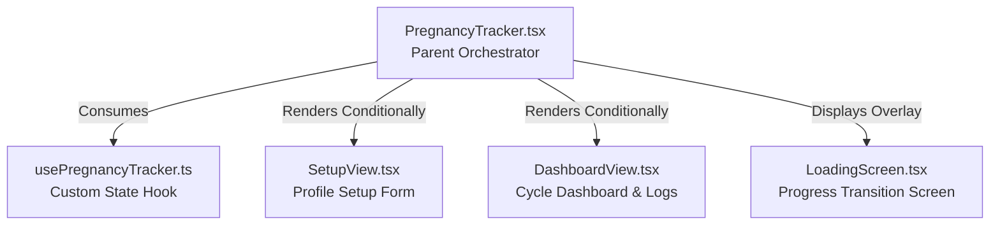

# Cat Pregnancy Tracker Architecture Documentation

This document describes the structure, data flow, and components of the Cat Pregnancy Tracker module in PawWiz.

---

## Architecture Overview

The tracker is split into three main components to ensure modularity, readability, and clean state sharing. The main controller component coordinates the state and triggers simulated transitions via the loading screen.



---

## 1. Parent Controller Component: `CatPregnancyTracker`
* **File Path**: [PregnancyTracker.tsx](file:///c:/Users/admin/IdeaProjects/PawWiz/packages/pawwiz-frontend/src/components/pregnancy-tracker/PregnancyTracker.tsx)
* **Role**: The main orchestrator and state controller.
* **Responsibilities**:
  - Consumes the [usePregnancyTracker.ts](file:///c:/Users/admin/IdeaProjects/PawWiz/packages/pawwiz-frontend/src/hooks/usePregnancyTracker.ts) hook to fetch shared states (mating date, logs history, progress metrics).
  - Maintains the `isLoading` local state to control the visibility of the loading transition.
  - Formulates today's context parameters (`todayStr`, `todayLog`, `todayLoggable`).
  - Defines the core tracking validation helper `isDateLoggable`.
  - Determines which view to render based on `isTracking` and `isLoading` flags.

---

## 2. Setup Component: `SetupView`
* **File Path**: [SetupView.tsx](file:///c:/Users/admin/IdeaProjects/PawWiz/packages/pawwiz-frontend/src/components/pregnancy-tracker/SetupView.tsx)
* **Role**: The profile builder screen.
* **Responsibilities**:
  - Displays a clean profile configuration prompt.
  - Integrates `react-datepicker` to select the mating date.
  - Enforces date boundaries (max date set to today).
  - Exposes calendar header controls to navigate months manually.
  - Triggers the simulated transition flow upon submission.

---

## 3. Tracker Dashboard Component: `DashboardView`
* **File Path**: [DashboardView.tsx](file:///c:/Users/admin/IdeaProjects/PawWiz/packages/pawwiz-frontend/src/components/pregnancy-tracker/DashboardView.tsx)
* **Role**: The core monitoring dashboard.
* **Responsibilities**:
  - **Left Summary Panel**: Shows Molly's pregnancy day metrics (elapsed day progress out of 65 gestation days, estimated due date, days remaining) and lists today's logged symptoms/behaviors.
  - **Right Calendar Panel**: Generates the current month calendar grid. Annotates elapsed pregnancy days, weekly milestones (e.g. `W1`, `W2`), and highlights days containing active logs.
  - **Bottom Symptoms Card**: Shows today's symptoms overview using visual icons (nesting, appetite up, etc.). Read-only until the overlay sheet is opened.
  - **Daily Logging Bottom Sheet**: A centered modal overlay allowing the user to configure symptoms (multi-select), behaviors/moods (multi-select), and record weight updates for a selected date.

---

## Data Structure: `DailyLog`
Stored inside `logs` record mapping string ISO dates (`YYYY-MM-DD`) to their logs:
```typescript
export interface DailyLog {
    symptoms: string[];   // Array of logged symptom labels (e.g. 'Nesting')
    moods?: string[];     // Array of logged behavior/mood labels (e.g. 'Calm')
    weight?: number;      // Numeric weight entry in kg
}
```

---

## Key Validation Logic: `isDateLoggable`
Restricts daily logs input using strict temporal constraints:
1. **No Future Dates**: Checks if the target calendar date is in the future.
2. **Within Pregnancy Duration**: Checks if the target calendar date falls within the 65 gestation days of the cycle (from Day 1 of mating up to Day 65).
```typescript
const isDateLoggable = (year: number, monthIdx: number, dayNum: number) => {
    if (!matingDate) return false;
    const calendarDate = new Date(year, monthIdx, dayNum);
    calendarDate.setHours(0, 0, 0, 0);

    const baseDate = new Date(matingDate + 'T00:00:00');
    baseDate.setHours(0, 0, 0, 0);

    const todayVal = new Date();
    todayVal.setHours(0, 0, 0, 0);

    if (calendarDate.getTime() > todayVal.getTime()) {
        return false;
    }

    const diffTime = calendarDate.getTime() - baseDate.getTime();
    const diffDays = Math.floor(diffTime / (1000 * 60 * 60 * 24));

    return diffDays >= 0 && diffDays < 65; // gestating phase (Day 1 - 65)
};
```
